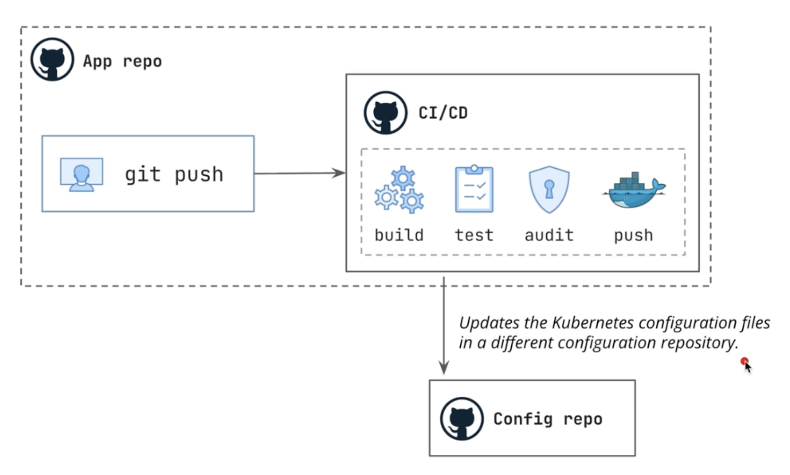
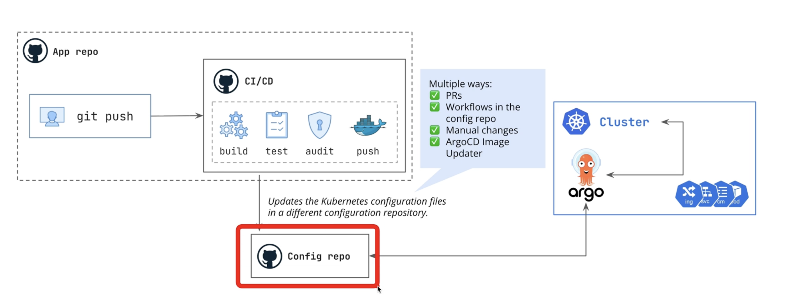
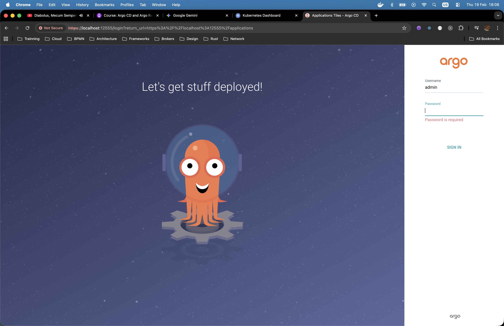
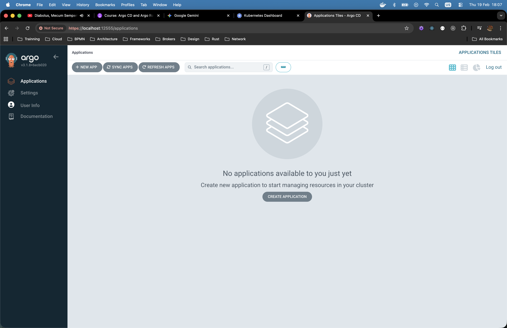
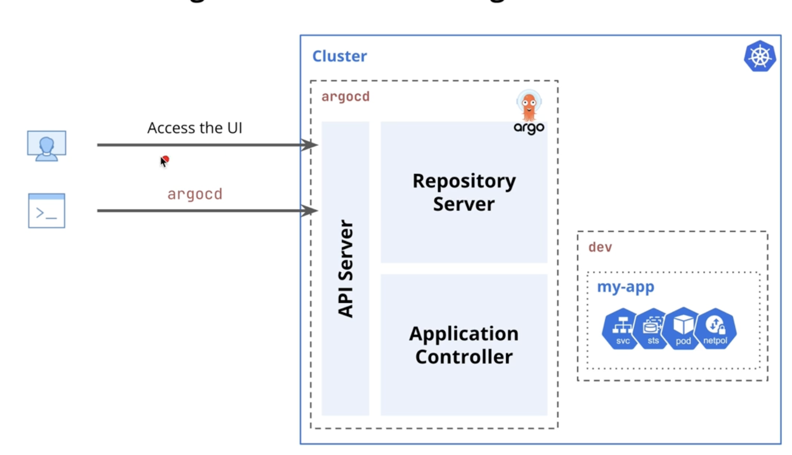
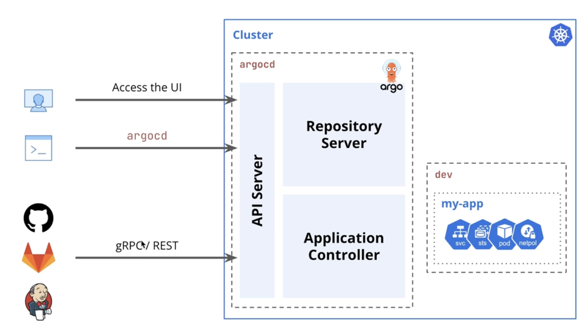
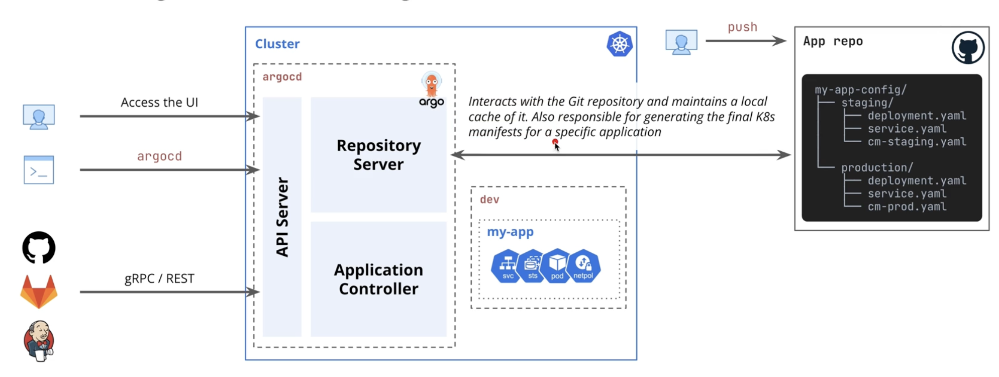
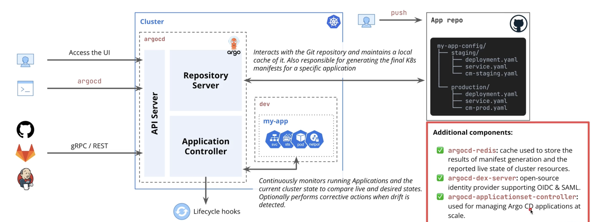
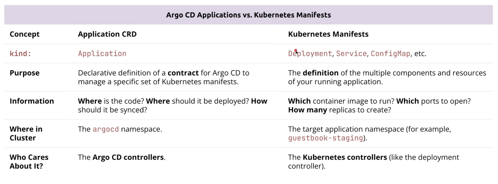

= ArgoCD and ArgoRollouts: The Definitive Guide

== Links

- https://github.com/lm-academy/argo-rollouts-course[Git Source]
- https://github.com/lm-academy/argocd-example-apps[Git Samples Source]

.Minikube conf initial setup
[source,bash]
----
minikube start \
  --driver=docker \
  --cpus=4 \
  --memory=12288 \
  --addons=ingress,metrics-server,dashboard
#
#  --kubernetes-version=v1.28.0
----

== The GitOps Philosophy

. Traditional git flow: git push -> CI/CD pipeline _(build|test|audit|push docker image)_ -> K8s Deployment (helm upgrade | kubectl apply), but what happens if anyone runs a `kubectl scale deployment my-dep --replicas=0/N` directly in the cluster?
The live state of the cluster is now different from the configuration stored over the Git.
Nobody knows what the real desired state.
Git says one thing, but the cluster is doing other, this causes *_Poor Auditability_*, *_Difficult Rollbacks_* and *_Inconsistent Deployments and Configuration_*

. So how the GitOps flow tackle this issues?
Updating a K8s Config files in a diff repo (best practice) as showed bellow

. ArgoCD Continually monitors this repo, should identify any difference, marks the resource as _out-of-sync_ and, if configured to do so, automatically reverts back to the state of configuration repo, over the _GitOps Principles_ that are: *Declarative way and Versioned and Immutable State, Pulled Automatically, Continuously Reconciled*

== Section 04

. Add the official Argo Project Helm repository to you Helm client
. Update your Helm repos to ensure you have the latest chat information

[source,bash]
----
helm repo add argo https://argoproj.github.io/argo-helm
helm repo update
----

. Created dedicated `_argocd_` namespace in the cluster

[source,bash]
----
k create namespace argocd
----

. Install `_argo-cd_` Helm-chart version 8.6.x into the argocd namespace

[source,bash]
----
helm install argo-cd argo/argo-cd --version 8.6.0 -n argocd
----

. Verify that all the Argo CD pods have been created and are in Running state

[source,bash]
----
k get pods -n argocd
k -n argocd get secret argocd-initial-admin-secret -o jsonpath="{.data.password}" | base64 -d; echo
# Console forward command
k port-forward svc/argo-cd-argocd-server -n argocd 12555:443
----

.http://localhost:12555/

.http://localhost:12555/

.ArgoCD CLI
[source,bash]
----
argocd login localhost:12555 --name local
argocd account get-user-info

# update password
argocd account update-password
----

== Section 05

.ArgoCD Architecture V1

.ArgoCD Architecture V2

.ArgoCD Architecture V3

.ArgoCD Architecture V4

=== The Application CRD

* The purpose of Application CRD is to be a declarative contract that describe several important pieces of information for ArgoCD to do its job

** *Project*: Under which ArgoCD project should the app be manged?
** *Source*: (spec.source) - _WHERE_ is the desired state defined?
This normally includes a Git Repo URL, a branch, and a path or Helm Chart
** *Destination*: (spec.destination): _WHERE_ should the manifests from that source be deployed?
More specifically, which cluster and namespace?
** *(Optional) Sync Policy*: (spec.syncPolicy): _HOW_ should the deployment be managed?
Should it be automated, prune resources, shelf-heal, etc?

[source,yaml]
----
apiVersion: argopro.io/v1alpha1
kind: Application
metadata:
  name: guestbook-prod
  namespace: argo
spec:
  project: default
  source:
    repoURL: <YOUR_REPO_URL>
    targetRevision: HEAD
    path: guestbook
  destination:
    server: <YOUR_K8S_SERVER>
    namespace: guestbook-prod
----

.Argo CD Applications vs Kubernetes Manifests

.Build my-app docker image
[source,bash]
----
docker build --no-cache --build-arg APP_NAME=my-app -t my-app -f Dockerfile.jvm .
docker tag my-app douglasdb/my-app
docker push douglasdb/my-app
----

